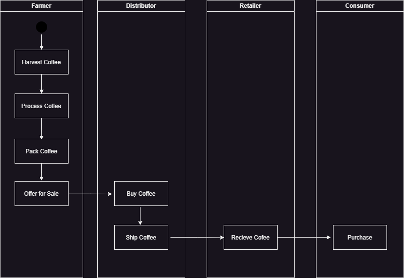
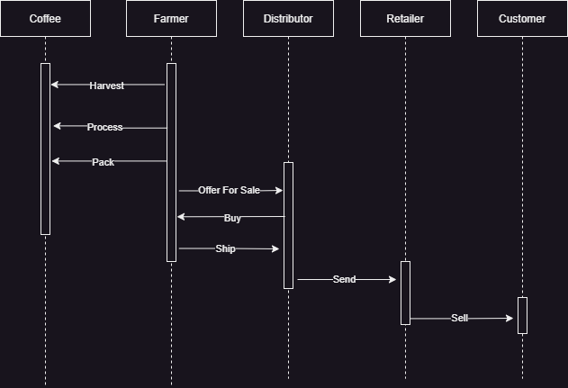
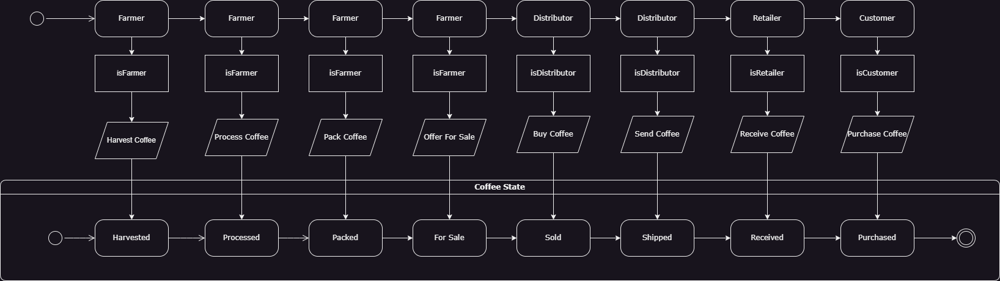
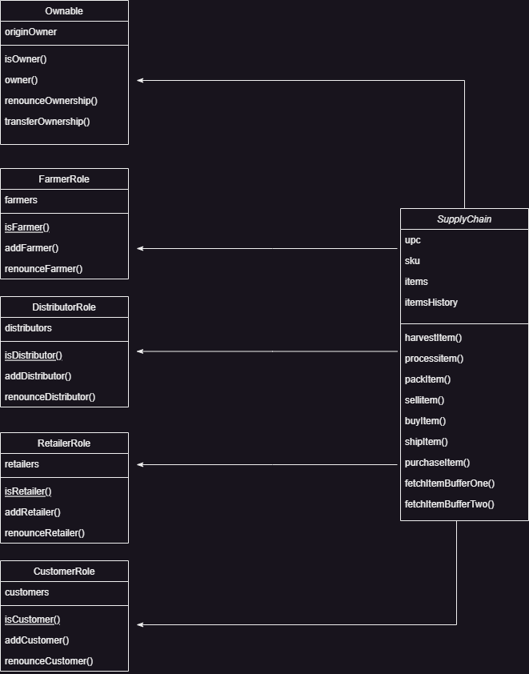

**Contract Address**: 0xAa75AC258AE53D8694E32fe5fce258AAB4613d79 \
**Transaction ID**: 0xe42fde923a278b80617e8a8d1b0021ced4e8f5e963279c58e87874bbce24b3a4

<h3>Libraries Used</h3>

web3.js - to access the Etherium blockchain \
truffle-contract.js - to create JS contract from ABI file

---
<h2>How to use</h2>

<h3>Framer</h3>

- Create item \
    Fill in the following inputs in **Product Overview**, **Farm Details** and **Product Details** forms:
    - SKU
    - UPC
    - Current Owner
    - Farmer ID
    - Farm Name
    - Farm Information
    - Farm Latitude
    - Farm Longitude
    - Product Notes

    After that click **Harvest** button.
- Process Item\
  Fill in the **UPC** input in **Product Overview** form, then click the **Process** button.
 - Process Item\
  Fill in the **UPC** input in **Product Overview** form, then click the **Process** button.
 - Pack Item\
  Fill in the **UPC** input in **Product Overview** form, then click the **Pack** button.
 - Pack Item\
  Fill in the **UPC** input in **Product Overview** form and **Product Price** in **Product Details** form, then click the **ForSell** button.

<h3>Distributor</h3>

- Buy Item\
  Fill in the **UPC** input in **Product Overview** form, then click the **Buy** button.
- Ship Item\
  Fill in the **UPC** input in **Product Overview** form, then click the **Ship** button.

<h3>Retailer</h3>

- Recieve Item\
  Fill in the **UPC** input in **Product Overview** form, then click the **Recieve** button.

<h3>Consumer</h3>

- Purchase Item\
  Fill in the **UPC** input in **Product Overview** form, then click the **Purchase** button.

---

<h2>Acivity diagram</h2>

<h2>Sequence diagram</h2>

<h2>State diagram</h2>

<h2>Class diagram</h2>

